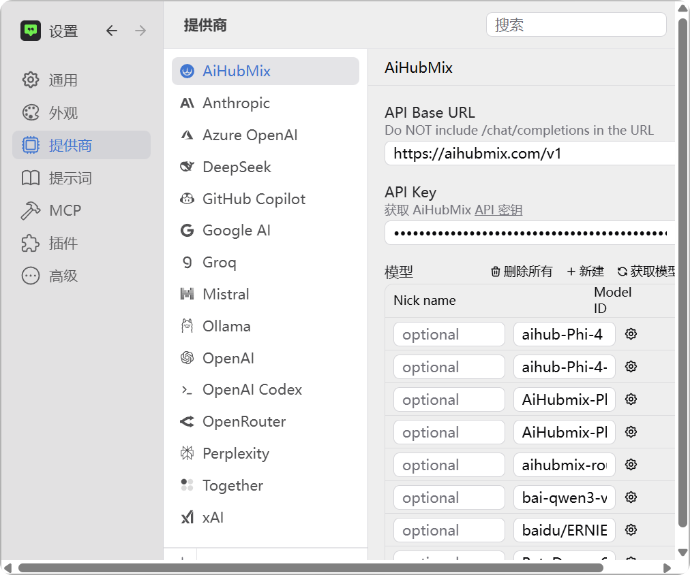
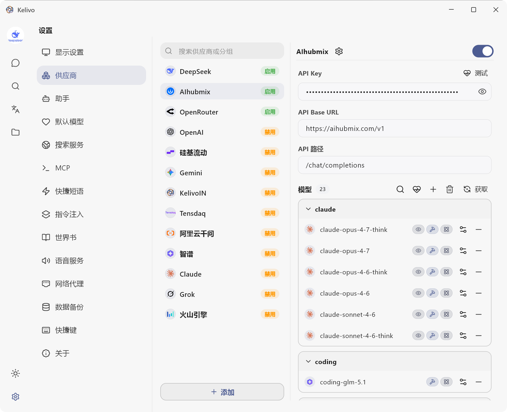
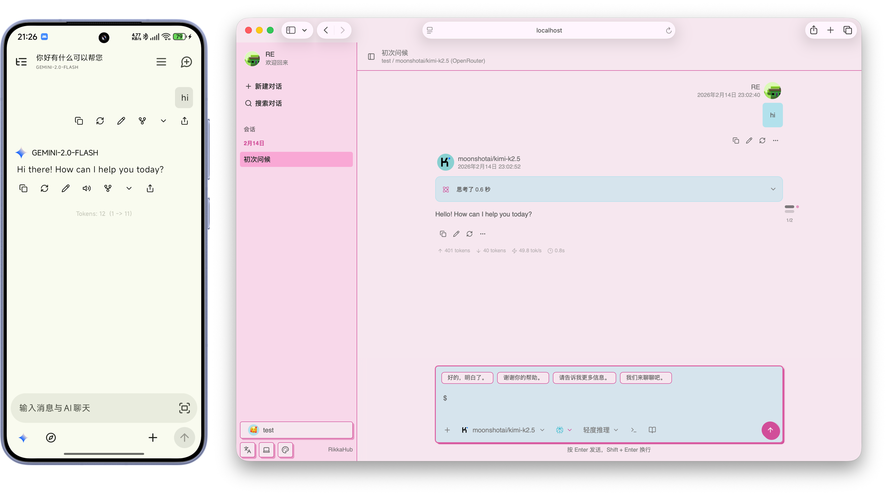

# LLM API壳子哪家强？
## 写在前面
目前手头主要的设备是一个Windows的电脑和Android的手机，作为一个事实概念上的穷人，同时对LLM的需求好像没有那么强烈，那么去开一个价值20$的GPT Plus之类的会员日用实在是有点开销不起，似乎按量付费的API更适合我这种轻量型选手。因此选择一个合适的壳子就显得尤为重要，在我广泛搜索了一些项目尝试后，也是找到了几款相对比较适合的LLM壳子，在这里进行一个推荐。
## Windows软件
### Chatwise
在Chatwise更换内核之前，软件整体非常轻量化，安装包文件仅约15 MB，在更换内核为electron内核后，安装包整体膨胀严重，但是在软件开启和响应方面没有区别，软件里面也没有广告和其他杂七杂八的API提供商广告，整体非常值得一用。

<table align="center" width="600">
  <tr>
    <td width="100" align="center">
      
    </td>
    <td>
      <h3>ChatWise</h3>
      
<strong>The fastest AI Chatbot for any LLM.</strong>

      

        
        
        
      

      

        <a href="https://github.com/egoist/chatwise-releases">GitHub</a> ·
        <a href="https://github.com/egoist/chatwise-releases/releases">Download</a> ·
        <a href="https://chatwise.app">Website</a>
      

    </td>
  </tr>
</table>

可能美中不足的是，和chatbox、cherry studio等比较出名的软件相比，chatwise软件的高级版需要购买，且不是买断制，长期使用可能每年都有一笔20美元的支出，但由于界面简洁没有广告，chatwise依然是我最为推荐的LLM Windows软件。

  

其使用方法和其他类似软件没有区别，支持官方API和 第三方中转服务，同时也支持网页搜索、网页内容获取和MCP服务器。但是相对来说，也有一些明显的缺点，聊天记录历史不支持批量删除，同时似乎也没有类似于其他官方服务的记忆功能，跨对话之间的内容联想可能存在一定缺失，同时软件也不支持多端的消息同步，这个但瑕不掩瑜，总体来说因其响应速度足够快，用起来足够轻便，还是值得推荐。

### Kelivo
这是一个我最近发现的开源项目，其最大的好处是支持几乎所有平台（甚至还有鸿蒙的事情）包括：Android、iOS、Harmony (kelivo-ohos)、Windows、macOS、Linux，而且基于Material You 设计语言，外观看起来很舒服，整体看着玩法更多，而且最重要的是开源+免费。更多优点可以看官网ReadMe文件。

<table align="center" width="600">
  <tr>
    <td width="120" align="center">
      
    </td>
    <td>
      <h3>Kelivo</h3>
      
<strong>A Flutter LLM Chat Client.</strong>

      

        
        
        
        
      

      

        
        
        
      

      

        <a href="https://github.com/Chevey339/kelivo">GitHub</a> ·
        <a href="https://github.com/Chevey339/kelivo/releases/latest">Download</a> ·
        <a href="https://kelivo.psycheas.top">Website</a>
      

    </td>
  </tr>
</table>

  

## Android
移动设备这种LLM软件其实非常多，而且在我身边其实大家都更愿意选择豆包、千问、deepseek的官方APP，尤其是豆包在各种应用场景都做得十分出色。但这些APP主要分散在各家，想换个模型就得切换不同的软件，其实有点不太方便，所以这里主要还是推荐一些开源的、All in one的项目。

### RikkaHub
Rikkahub是一个和Kelivo类似的开源软件，甚至可以说两者在安卓上的设计逻辑感觉都差不多，依旧是基于Material You设计，支持MCP、Markdown 渲染、搜索、记忆等功能。

<table align="center" width="600">
  <tr>
    <td width="120" align="center">
      
    </td>
    <td>
      <h3>RikkaHub</h3>
      
<strong>A native Android LLM chat client that supports multiple providers.</strong>

      

        
        
        
        
      

      

        
        
        
        
      

      

        <a href="https://github.com/rikkahub/rikkahub">GitHub</a> ·
        <a href="https://github.com/rikkahub/rikkahub/releases/latest">Download</a> ·
        <a href="https://rikka-ai.com">Website</a>
      

    </td>
  </tr>
</table>

  

