和之前一样，这里会整理出最近针对电化学阻抗谱（EIS）学习的一些总结，参考文献同样会放在结尾部分，自己也是初学者，肯定会存在一些错误和不正确的，欢迎大家指出。

⬇️**放个目录先：**
[TOC]

# EIS的整体介绍

电化学阻抗谱 (EIS) 是电化学系统分析的强大工具。通过采用小幅值的正弦电流或电压作为输入信号，在电化学系统产生近似线性的响应，从而获得电池在时域和频域上的阻抗。由于LIB的内部电化学过程具有不同的弛豫时间来响应扰动，因此阻抗谱可以进行复杂的检测，并通过进一步建模与不同的成分解耦。

具体来说，根据输入信号的不同，EIS可以分为恒电位EIS（PEIS）和恒电流EIS（GEIS）。一般情况下PEIS可以满足大部分要求，但是GEIS在一些低阻抗系统（尤其是商业的软包或硬壳电池）有很好的效果。尽管两种测试的输入信号不同，但是其机制确实相同的。在线性系统中，特定频率的正弦电位信号输入会导致相同频率且具有相位角（$\phi$）的正弦电流输出。根据欧姆定律，可以获得电化学系统在不同频率下的阻抗。将结果借助欧拉公式转换，可以将函数转化为实部（$Z'$）和虚部（$Z^"$）的和。

目前Nyquist和Bode图是两种使用最为广泛的显示阻抗特征的方法。Nyquist图将阻抗的实部作用于$x$轴，将负虚部作用于$y$轴，以说明阻抗在频率范围内的变化。Bode图以阻抗的模数（$|Z(\omega)|$和相位角（$\phi (\omega)$），对数频率为横坐标，直接显示图表中有关频率的信息。

由于EIS数据的质量对建模和解释过程有着重要影响，数据验证在提高EIS的可信度和可靠性方面发挥着重要作用。为了获得可靠的EIS数据，应满足三个条件，即线性、因果性和稳定性。线性意味着输入信号与输出响应之间的关系是线性的。然而，描述电化学过程动力学特征的巴特勒-沃尔默方程本质上是非线性的。因此，实验中通常应采用小幅度的扰动信号以接近线性状态。

EIS中阻抗实部和虚部之间的相互依赖性是这种变换的基本要素，因此，阻抗测量数据的有效性可以通过使用 Kramers-Kronig 关系进一步评估。 Kramers-Kronig 关系可以使用以下方程从虚部计算阻抗的实部，反之亦然。

$$
Z^{\prime}(\omega)=R_{\infty}+\frac{2}{\pi} \int_0^{\infty} \frac{x Z^{\prime \prime}(x)-\omega Z^{\prime \prime}(\omega)}{x^2-\omega^2} \mathrm{~d} x
$$

$$Z^{\prime \prime}(\omega)=\frac{2 \omega}{\pi} \int_0^{\infty} \frac{Z^{\prime}(x)-Z^{\prime}(\omega)}{x^2-\omega^2} d x$$

考虑到计算过程的复杂性，目前已经有多种开源闭源软件来帮助科研人员完成这个计算，B站up[贱小贱0220](https://space.bilibili.com/435793314)在[视频](https://www.bilibili.com/video/av113516069587261/)中给出了借助Zview 4.0c完成k-k验证的过程；Schönleber等人开发了"Lin_kk"工具来完成类似的分析。通过k-k变换，可以得到各个单点的实际值和计算值之前的残差，只有当残差小于1%时，EIS数据才被认为是可信的。

$$ \Delta_{\mathrm{Re}}(\omega)=\frac{Z^{\prime}(\omega)-\hat{Z}^{\prime}(\omega)}{|Z(\omega)|}$$

$$\Delta_{\mathrm{Im}}(\omega)=\frac{Z^{\prime}(\omega)-\hat{Z}^{\prime}(\omega)}{|Z(\omega)|}$$

后面我也会给出Lin_kk软件简单的安装过程和数据导入过程。

# EIS中电路的各类阻抗和图谱

## 基本无源器件的阻抗

阻抗是电路中电阻（R）、电容器（C）和电感器（L）总共导致的阻力。根据不同无源器件的连接方式不同，电路的阻抗也不同。我们假定特定频率下为电路引入低振幅的交流电压信号，

$$v(t)=V_{\mathrm{0}} \sin (\omega t)$$

该信号在电路内产生同频率的交流电流信号，

$$i(t)=I_{\mathrm{0}} \sin (\omega t+\phi)$$

测量后，电路在该频率下的阻抗$Z(\omega)$，

$$Z(\omega)=|Z| e^{j \varphi}=|Z|(\cos \varphi+j \sin \varphi)=Z^{\prime}+j Z^{\prime \prime}$$

Z‘是x轴上电阻的实部，Z"是y轴上的电阻的虚部，|Z|是阻抗的模，而 $\varphi = \omega t$是相位，其中，

$$Z^{\prime}=|Z| \cos \varphi$$

$$Z^{\prime \prime}=|Z| \sin (\varphi) $$

$$|Z|=\sqrt{\left(Z^{\prime}\right)^2+\left(Z^{\prime \prime}\right)^2}$$

$$\tan (\varphi)=\frac{Z^{\prime \prime}}{Z^{\prime}} \text { and } \varphi=\tan ^{-1}\left(\frac{Z^{\prime \prime}}{Z^{\prime}}\right)$$

对于一个在直流电路中的电阻、电容和电感，电流在电阻中流动正常受到阻碍，在电容中无法流动，在电感中由于不存在电流的变化，因此不存在电阻，其分别存在以下方程：

$$R=\frac{V}{i}$$

$$q=CV$$

$$V=L\frac{di}{dt}$$

在交流电路中，电流的流动也会受到电容和电感的阻碍，被称为电抗，可以分别表示为$X_C$和$X_L$，下面给出电阻、电容和电感在交流电路中的阻抗方程：

$$Z_R=R$$

将交流电压$v(t)=V_{\mathrm{0}} \sin (\omega t)$施加到电容上，则交流电流可以表示为：

$$i(t)=\frac{\mathrm{d} q}{\mathrm{~d} t}=\frac{C \mathrm{~d} v}{\mathrm{~d} t}=C\left(\frac{\mathrm{~d} v}{\mathrm{~d} t}\right)=V_0\omega C \cos(\omega t)$$

**当$\omega t=\pi/2$时，其阻抗为**

$$X_{\mathrm{C}}=\frac{V_{\mathrm{o}}}{I_{\mathrm{o}}}=\frac{V_{\mathrm{o}}}{V_{\mathrm{o}} \omega C}=\frac{1}{\omega C}=\frac{1}{2 \pi f C}$$

**同理，电感的阻抗为，**

$$X_{\mathrm{L}}=\omega L=2 \pi f L$$

## 简单电路元件阻抗

EIS 的一大优点是对等效电路的数据（阻抗谱）进行模拟，并以这种方式检索电路中包含的组件的数值。目前有Zview、Zplot等软件可以将Nyquist图拟合等效电路。

**当电路只包含一个电阻时**，其阻抗的方程为：

$$Z=R+j_0$$

考虑到其虚部为0，所以在Nyquist图上反映为实轴上的单个点。

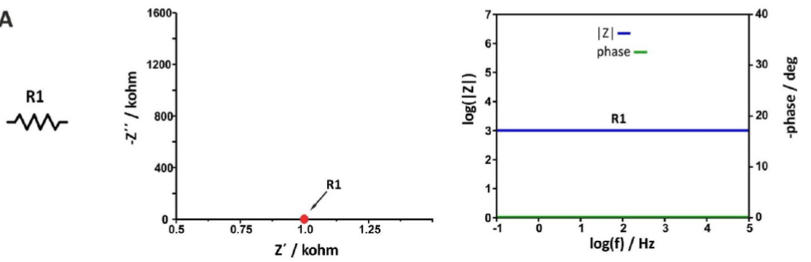

**当电路中只包含一个电容时**，阻抗方程为：

$$Z=0+\frac{1}{j\omega C}=0-j\frac{1}{\omega C}$$

实部为零，而虚部与电容和频率成反比。因此，Nyquist图显示*y*轴上有一条直线（实际阻抗为零）。接近零的值对应于高频，而在较低频率下，阻抗值较高。

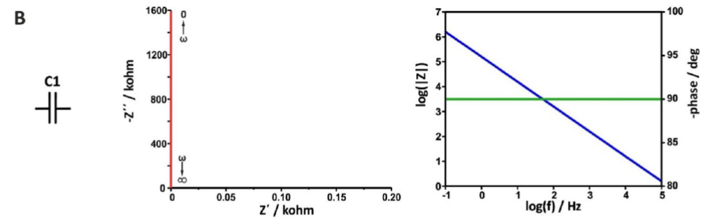

**当电路仅包含电感时**，阻抗方程为：

$$Z=0+\omega L$$

实部为零，而虚部与线圈的电感和频率成正比。因此，奈奎斯特图显示一条直线位于*y*轴上，位于实轴下方.

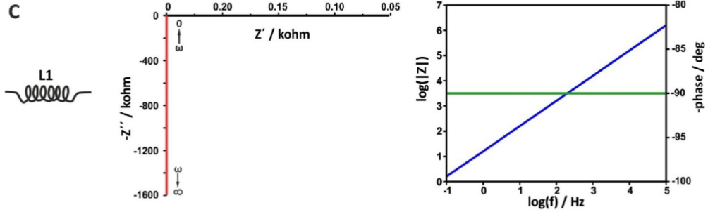

当电路包含串联的电阻器和电容器时，阻抗方程为：

$$Z(\omega)=\mathrm{R} 1+\frac{1}{j \omega \mathrm{C} 1}=\mathrm{R} 1-j \frac{1}{\omega \mathrm{C} 1}$$

在这种情况下，实部为$Z'=R1$，虚部为$Z^"=1/\omega C1$。

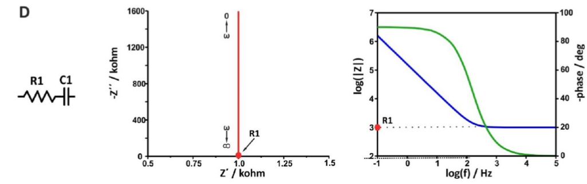

当电路中仅包含一个电阻或者一个电容时，Nyquist图为上述图的组合

## 组合元件阻抗与Nyquist图

**当电路包含并联的电阻器和电容器时**，阻抗方程如下：

$$Z(\omega)=\frac{1}{\frac{1}{\mathrm{R} 1}+j \omega \mathrm{C} 1}=\frac{\mathrm{R} 1}{1+j \omega \mathrm{R} 1 \mathrm{C} 1}=\frac{\mathrm{R} 1}{1+(\omega \mathrm{R} 1 \mathrm{C} 1)^2}-j \frac{\omega \mathrm{R} 1^2 \mathrm{C} 1}{1+(\omega \mathrm{R} 1 \mathrm{C} 1)^2}$$

在这种情况下，在非常高的频率下，容抗趋于零，所有电流都通过电容器；在非常低的频率下，容抗趋于无穷大

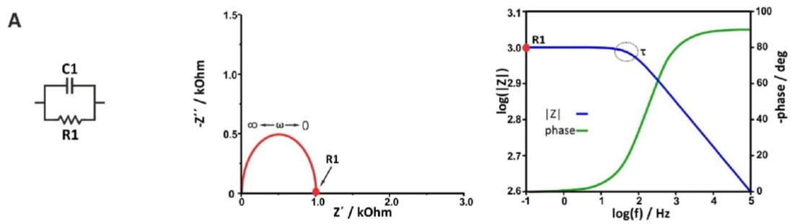

这个阻抗方程分为实部虚部写为：

$$\begin{aligned}
& Z_{R_e}=\frac{R_1}{1+\left(w R_1 C_1\right)^2} \\
& Z_{I m}=\frac{\omega  R_1^2 C_1}{1+\left(w R_1 C_1\right)^2}
\end{aligned}$$

注意到，上面两式可以变换为：

$$\begin{aligned}
& \left(Z_{R e}-\frac{1}{2} R_1\right)^2=\frac{\left.R_1^2-R_1^2\left[1+\left(w R_1 C_1\right)^2\right]+\frac{1}{4} R_1^2\left[1+W R_1 C_1\right]^2\right]^2}{\left[1+\left(W R_1 C_1\right)^2\right]^2} \\
& Z_{I m}^2=\frac{\left(\omega R_1^2 C_1\right)^2}{\left[1+\left(\omega R_1 C_1\right)^2\right]^2}
\end{aligned}$$

两边相加可以得到：

$$\left(Z_{R e}-\frac{1}{2} R_1\right)^2+Z_{Im}^2=\frac{1}{4}R_1^2$$

考虑到实际意义，可以看出，这种情况下电路的Nyquist图为一个圆心为$\frac{1}{2}R_1$，半径为$\frac{1}{2}R_1$的半圆。

**当在下列电路中时**，阻抗方程可以写为：

$$Z(\omega)=\mathrm{R} 0+\frac{\mathrm{R} 1}{1+(\omega \mathrm{R} 1 \mathrm{C} 1)^2}-j \frac{\omega \mathrm{R} 1^2 \mathrm{C} 1}{1+(\omega \mathrm{R} 1 \mathrm{C} 1)^2}$$

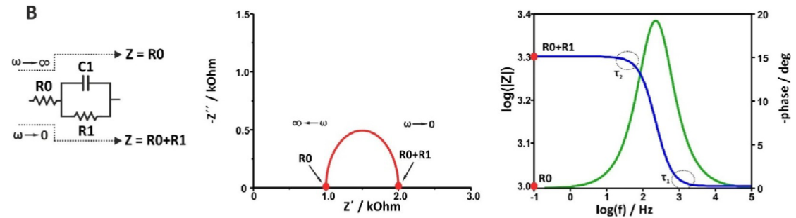

同理可以转换为：

$$\left(Z_{R e}-R_0-\frac{1}{2} R_1\right)^2+Z_{Im}^2=\frac{1}{4}R_1^2$$

这种情况下电路的Nyquist图为一个圆心为$R_0+\frac{1}{2}R_1$，半径为$\frac{1}{2}R_1$的半圆。

若在下面的电路中，阻抗方程可以写为：

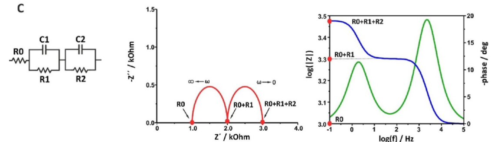
$$
Z(\omega) = \left[\mathrm{R}_0 + \frac{\mathrm{R}_1}{(\omega \mathrm{R}_1 \mathrm{C}_2)^2 + 1} + \frac{\mathrm{R}_2}{(\omega \mathrm{R}_2 \mathrm{C}_1)^2 + 1}\right] - j \left[\frac{\omega \mathrm{R}_1^2 \mathrm{C}_2}{(\omega \mathrm{R}_1 \mathrm{C}_2)^2 + 1} + \frac{\omega \mathrm{R}_2^2 \mathrm{C}_1}{(\omega \mathrm{R}_2 \mathrm{C}_1)^2 + 1}\right]
$$
实部和虚部为：
$$
Z'(\omega) = \mathrm{R}_0 + \frac{\mathrm{R}_1}{(\omega \mathrm{R}_1 \mathrm{C}_2)^2 + 1} + \frac{\mathrm{R}_2}{(\omega \mathrm{R}_2 \mathrm{C}_1)^2 + 1}
$$

$$
Z''(\omega) = -\left[\frac{\omega \mathrm{R}_1^2 \mathrm{C}_2}{(\omega \mathrm{R}_1 \mathrm{C}_2)^2 + 1} + \frac{\omega \mathrm{R}_2^2 \mathrm{C}_1}{(\omega \mathrm{R}_2 \mathrm{C}_1)^2 + 1}\right]
$$
根据大佬朋友的分析，**其形状受到电阻和电容数值的调控**（倒也合理）：

令$u=\omega R_1C_2,k=\frac{R_2C_1}{R_1C_2}$，则
$$\begin{aligned}
Z'(\omega) &= R_0+\frac{R_1}{u^2+1}+\frac{R_2}{(ku)^2+1} \\
Z''(\omega) &= -(\frac{uR_1}{u^2+1}+\frac{kuR_2}{(ku)^2+1})
\end{aligned}$$
可以进一步写为：

$$\begin{aligned}
y_1 &= R_0+x_1+x_2 \\
y_2 &= -(y_1+y_2)
\end{aligned}$$
其中，易得
$$\begin{aligned}
y_1^2&=x_1(R_1-x_1) \\
y_1^2&=x_1(R_1-x_1)
\end{aligned}$$
这是两个半径为$\frac{R_1}{2},\frac{R_2}{2}$的圆，因此，这个情况下，实部和虚部在复平面内形成两个叠加的半圆，其叠加的程度取决于参数$k=\frac{R_2C_1}{R_1C_2}$的值，或者说取决于两个电容和电阻的值。

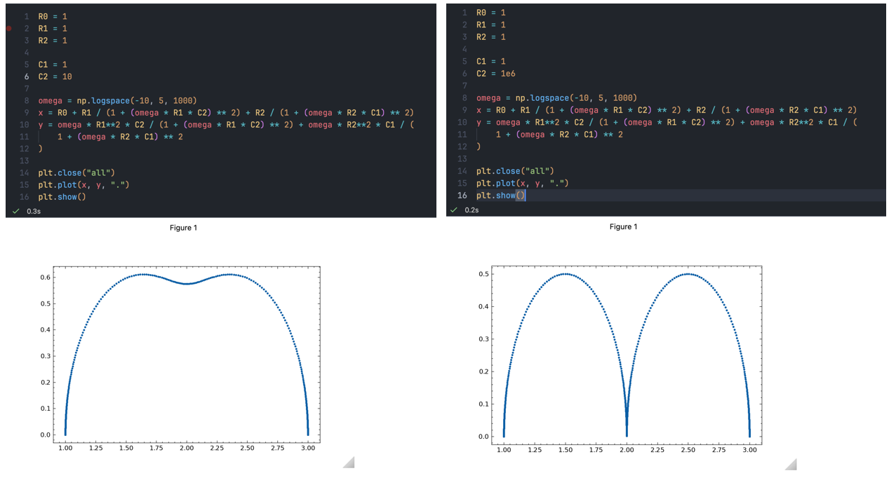

## The Randles（兰德尔斯） 电路

电池体系中存在氧化还原对 (Ox/Red)，在这种情况下施加小的正弦电压扰动测量电化学电池，满足法拉第EIS─兰德尔斯电路。下图给出Randles电路的等效电路图：

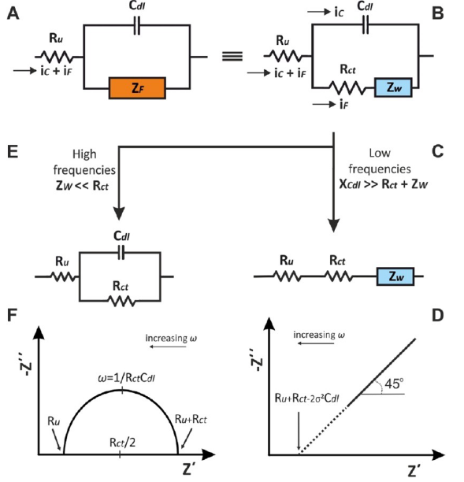

其中，总阻抗$Z_F$为氧化还原反应过程的动力学和氧化还原物质向工作电极表面的扩散；$C_{dl}$代表电极|电解质界面处的双电层表现出的电容器；未补偿电阻$R_u$表示在小幅度电压扰动下，参比电极和工作电极之间电解质的欧姆电阻，大多数情况下可以忽略不记。

就总阻抗$Z_F$而言，其满足
$$
Z_{\mathrm{F}}=R_{\mathrm{ct}}+Z_{\mathrm{W}}
$$
其中，$R_{ct}$为电荷转移阻抗与假设氧化还原物质不吸附在电极表面时的非均相电化学过程动力学有关，
$$
 R_{\mathrm{ct}}=\frac{R T}{k^0 n^2 F^2 A C} 
$$
其中$k^0$是非均相电子转移速率，单位为 $cm\cdot s^{-1}$， n是电化学反应中转移的电子数， *F*是法拉第常数，*R*是气体常数，*T*是温度，*A*是工作电极的电活性表面积（以 $cm^2$为单位）， *C*是氧化还原物质的浓度，假设该浓度与本体溶液中的相同，

$Z_W$为Warburg阻抗，表示考虑半无限线性扩散时氧化还原物质向电极表面质量传输的难度，也被称为扩散电阻。这一阻抗取决于
电位扰动的频率。高频时，因反应物不必扩散太远，Warburg阻抗很小。低频时，反应物需扩散很远，造成Warburg阻抗增大。

$Z_W$表现为$R_W-C_W$的串联电路，其中$R_W$和$C_W$都与频率相关，因此可以写为：
$$
Z_{\mathrm{W}}=R_{\mathrm{W}}+C_{\mathrm{W}}=\left[\sigma \omega^{-1 / 2}-j\left(\sigma \omega^{-1 / 2}\right)\right]
$$
其中，$\sigma$为
$$
\sigma=\frac{2 R T}{n^2 F^2 \sqrt{2} \sqrt{D} C}
$$
*D*为氧化还原对的扩散系数，单位为$(\mathrm{cm^2s^{-1}})$

在以上电路中，其在较宽频率范围的阻抗实部和虚部分别为：
$$
Z^{\prime}=R_{\mathrm{u}}+\frac{R_{\mathrm{ct}}+\sigma \omega^{-1 / 2}}{\left(\sigma \omega^{1 / 2} C_{\mathrm{dl}}+1\right)^2+\omega^2 C_{\mathrm{dl}}^2\left(R_{\mathrm{ct}}+\sigma \omega^{-1 / 2}\right)^2} \\
-Z^{\prime \prime}=\frac{\omega C_{\mathrm{dl}}\left(R_{\mathrm{ct}}+\sigma \omega^{-1 / 2}\right)^2+\sigma^2 C_{\mathrm{dl}}+\sigma \omega^{-1 / 2}}{\left(\sigma \omega^{1 / 2} C_{\mathrm{dl}}+1\right)^2+\omega^2 C_{\mathrm{dl}}^2\left(R_{\mathrm{ct}}+\sigma \omega^{-1 / 2}\right)^2}
$$

在低频时，$C_{dl}$所在电路无法导通，电流通过$R_u,R_{ct},Z_W$，三者相互串联，实部虚部分别为：

$$
\begin{aligned}
& Z^{\prime}=R_{\mathrm{u}}+R_{\mathrm{ct}}+\sigma \omega^{-1 / 2} \\
& Z^{\prime \prime}=-\sigma \omega^{-1 / 2}-2 \sigma^2 C_{\mathrm{dl}} \\
\end{aligned}
$$
化简可以得到：
$$-Z^{\prime \prime}=Z^{\prime}-R_{\mathrm{u}}-R_{\mathrm{ct}}+2 \sigma^2 C_{\mathrm{dl}}$$
可以看出，在低频范围内，其图像为斜率为1的直线，其与实轴交与点
$$Z^{\prime}=R_{\mathrm{u}}+R_{\mathrm{ct}}-2 \sigma^2 C_{\mathrm{dl}}$$
在高频下，$C_{dl}$不可忽略，同时考虑$R_{ct}\gg Z_W$，因此电路为$C_{dl}$与$R_{ct}$并联再与$R_u$串联，此时的形式与之前证明的相同，实部虚部为：
$$\begin{aligned}
Z^{\prime}&=R_{\mathrm{u}}+\frac{R_{\mathrm{ct}}}{1+\omega^2 C_{\mathrm{dl}}^2 R_{\mathrm{ct}}^2} \\
Z^{\prime \prime}&=-\frac{\omega C_{\mathrm{dl}} R_{\mathrm{ct}}^2}{1+\omega^2 C_{\mathrm{dl}}^2 R_{\mathrm{ct}}^2}
\end{aligned}$$
其形式为一个圆，方程为：
$$
\left(Z^{\prime}-R_{\mathrm{u}}-\frac{R_{\mathrm{ct}}}{2}\right)^2+\left(Z^{\prime \prime}\right)^2=\left(\frac{R_{\mathrm{ct}}}{2}\right)^2
$$
最终，理想 Randles 电路的Nyquist图为

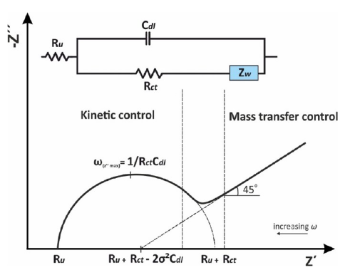

## 恒相位元件（CPE）

上述Randles 电路中所得Nyquist图只有在完全平坦的电极（例如液态滴汞电极）中才能观察到，锂离子电池中常见的固体电极，包括偏平金属电极、石墨电极、3D丝网印刷电极等，所得Nyquist图均与理想情况有所偏差。

因此恒相位元件被广泛应用于交流阻抗的等效电路中，用来对实验数据进行拟合。具体来是，CPE主要用来描述非理想状态下的双电层电容$C_{dl}$，电极表面的不均匀性、粗糙度、电极的空隙率和电极的几何形状都可能造成电流和电位的分布不均匀。

CPE 的阻抗由方程如下：

$$
Z_{\mathrm{CPE}}=\frac{1}{Y_{\mathrm{o}}(j \omega)^n}
$$

其中，$Y_0$为包含电容信息的参数，单位为$(Ohm^{-1}s^n )$或$(F s^{n-1})$，n为范围为0~1的常数，定义为与理想双电层电容行为的偏差（理想状态下$\phi =90^{\circ}$），其与阻抗谱倾斜程度$\theta$的关系为：
$$\theta=90^{\circ}(1-n)$$
特别的，当n=0时，阻抗可以写作$Z=Y_0^{-1}$，此时CPE表现为电阻；当n=0.5时，方程可以写作$Z=1/Y_0\sqrt{j\omega}$，即为Warburg阻抗$Z_W$。

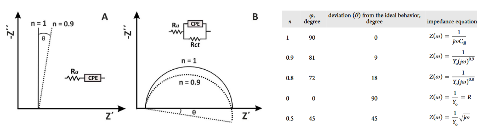

## 锂离子电池中的EIS

## Lin_KK软件的安装与使用

从阻抗谱中提取我们所需要的信息非常依赖于谱图本身的质量，因此阻抗谱数据的K-K验证是处理阻抗数据过程中重要的部分。Up主**贱小贱0220**在其视频中分享过Nova 2.1和Zview 4.0c有关K-K验证的相关教程，除去这两个软件之外，文献中还报道过使用Lin_kk软件对阻抗谱进行K-K验证的信息。这里主要会分享下Lin_kk软件安装和数据导入等过程中可能遇到的问题和难点。

### 软件下载与安装

考虑到软件本身有文献支撑，且是在互联网上公开的信息，因此这里针对下载主要给出在官网界面上下载的方法。

下载网站：https://www.iam.kit.edu/et/english/Lin-KK.php

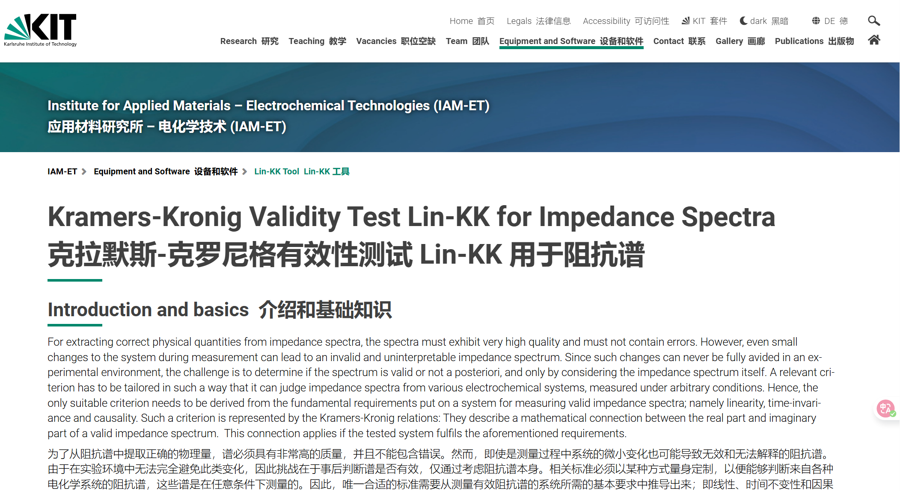

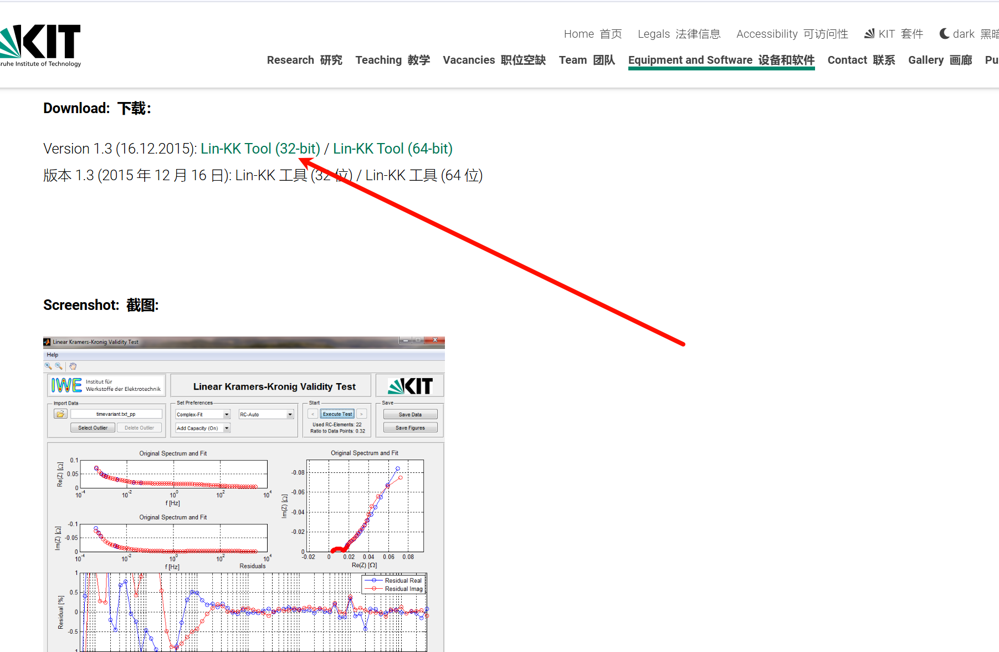

在如上界面中找到Download即可，这里需要注意的是，经过我个人的尝试，安装64位软件有可能会导致软件反复出现闪退和无法导入数据的情况，如果需要下载64位，请基于自己的电脑的实际情况进行尝试，这里以32位软件为例。

下载后安装包内理论上包含下列内容：

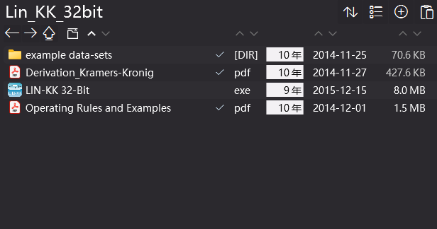

双击exe文件即可开始安装，然后一路按照指示安装即可，需要注意的是软件需要基于Matlab，所以会在过程中自动安装Matlab R2013b 软件，请确保磁盘有足够的空间进行安装。

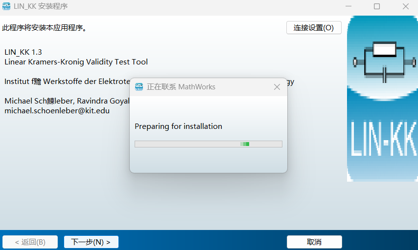

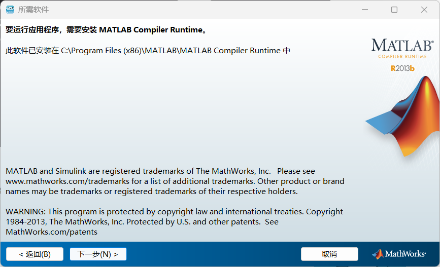

安装完成后运行，如果看到这个界面，即为安装成功。

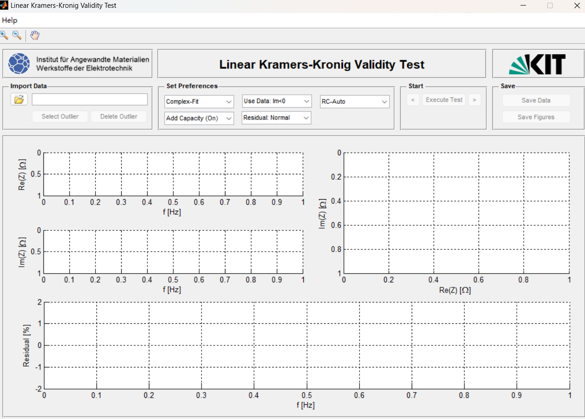

### 数据导入

实验室内常见的获取阻抗数据的设备可能有辰华CHI660/760e，普林斯顿等，这些设备配套的软件导出的数据文件结构各不相同，这里在导入前需要确保数据格式满足下面的要求。

Excel文件：请按照下列格式进行数据处理，请注意不要修改表头。

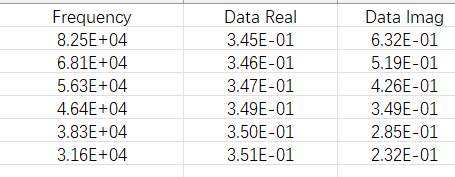

TXT文件：请按照下列格式进行数据处理，请注意不要修改表头。

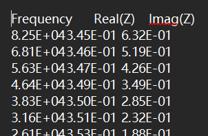

修改完成格式后，在软件内导入对应的文件，如果能看到蓝色的点，即为导入成功。

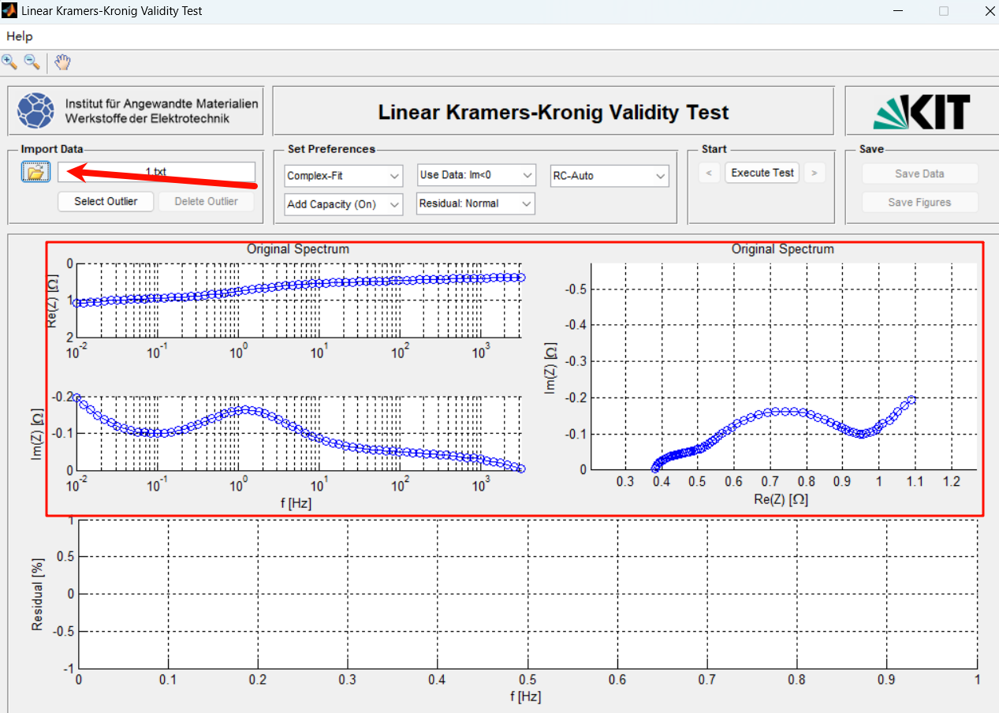

完成导入后按照自己的需求修改Set Preferences 位置的相关参数，并点击Start位置的按钮，出现红色点即表示完成。红色点即为通过K-K验证计算出的实部和虚部，下方为数据的误差情况。完成后可以在Save对数据进行保存。

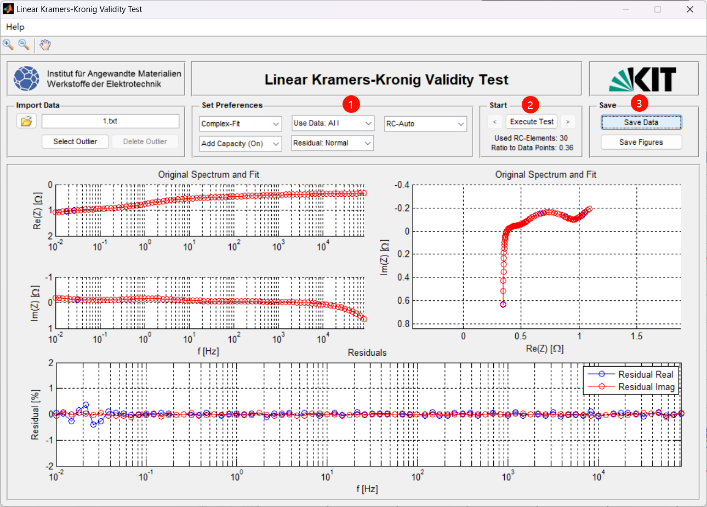

到此即完成Lin_KK进行KK验证的主要步骤。

